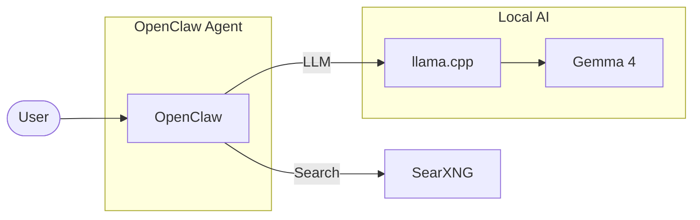

# OpenClaw Gemma4 Local on 1050ti

Local OpenClaw setup with Gemma 4 (E2B MTP) and SearXNG for private, cost-free AI search and agent workflows on a GTX 1050 Ti (4GB VRAM).

## Architecture



## Device Info

* Windows WSL, Ubuntu 22.04
* CPU: Intel(R) Core(TM) i5-8400 CPU @ 2.80GHz, 6 cores
* RAM: 24 GB, 22GB for WSL
* GPU: NVIDIA GeForce GTX 1050 Ti, 4GB VRAM
* CUDA 12.6

## Preparations

### 1. Environment

#### * Windows and WSL
* GPU driver on windows
* Docker on WSL
* WSL settings (firewall and memory)
* Python uv on WSL

#### * GPU for WSL (Optional, if LLM is run on WSL)
* GPU driver on WSL
* Cuda on WSL
* NVIDIA Container Toolkit on WSL

### 2. Local LLM

Please refer to this [document](./llm.md), steps:

1. Download and build llama.cpp
2. Download LLM (Gemma4 E2B)
3. Run LLM by llama.cpp

### 3. SearXNG

Please refer to this [document](./searxng/README.md), steps:

1. Download docker compose file and .env
2. edit .env
3. start the service

### 4. Discord

#### 1. Go to Discord Developer Portal, create Bot once

(1) Go to https://discord.com/developers/applications

(2) New Application → name OpenClaw

(3) Click Bot → set Username

(4) Privileged Gateway Intents turn on: Message Content Intent, Server Members Intent, Presence Intent (optional)

#### 2. Copy Bot Token

(1) Click Reset Token → copy Bot Token (do not share this to other)

(2) Click OAuth2 → URL Generator
Check: bot and applications.commands
Check Auth:
View Channels、Send Messages、Read Message History、Embed Links、Attach Files

(3) Add bot to Discord server

Copy invatation link, Click it and add bot to Discord server

## OpenClaw setup

* my openclaw version 2026.6.11

```bash
git clone https://github.com/openclaw/openclaw.git
cd openclaw

export OPENCLAW_IMAGE="ghcr.io/openclaw/openclaw:latest"
./scripts/docker/setup.sh

# check the gateway token in your config /.openclaw/openclaw.json
# gateway.auth.token
# copy this gateway token

# go to http://127.0.0.1:18789
# paste your gateway token on Web UI

# searxng setup
docker exec -it openclaw-openclaw-gateway-1 bash

export SEARXNG_BASE_URL="http://<your self-hosted SearXNG IP>:<port>"
openclaw configure --section web
openclaw plugins install @openclaw/searxng-plugin
openclaw plugins list # check if searxng in list
exit

docker compose restart
```

### OpenClaw Connect to Discord

Allow Discord server Id if connection is not correctly set.

#### (1) Turn on Developer Mode

Click settings -> advanced -> turn on Developer Mode

#### (2) Check Discord server Id

On Discord (Desktop or Web version), right click the server -> copy server Id

#### (3) Edit ~/.openclaw/openclaw.json

See the example below or refer to this [config](./openclaw.json)

```json
{
	"channels": {
		"discord": {
			"enabled": true,
			"token": "<discord token>",
			"groupPolicy": "allowlist",
			"guilds": {
				"<discord server id>": {
					"requireMention": false,
					"slug": "my-server"
				}
			}
		}
	}
}
```

#### (4) Restart OpenClaw

`docker compose restart`